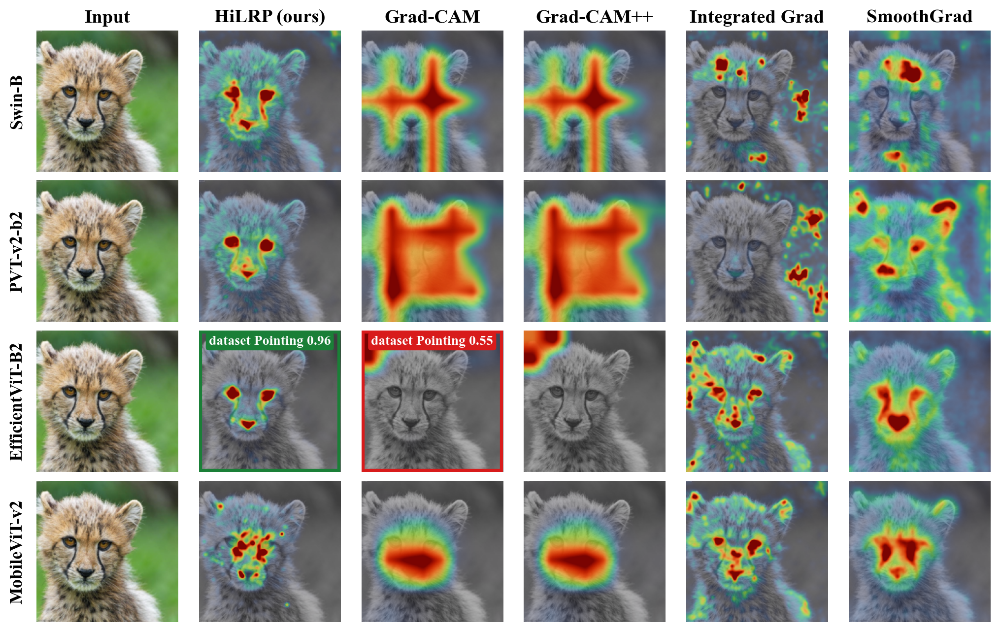
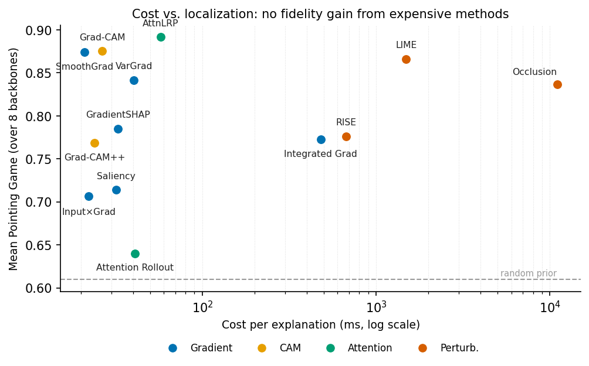
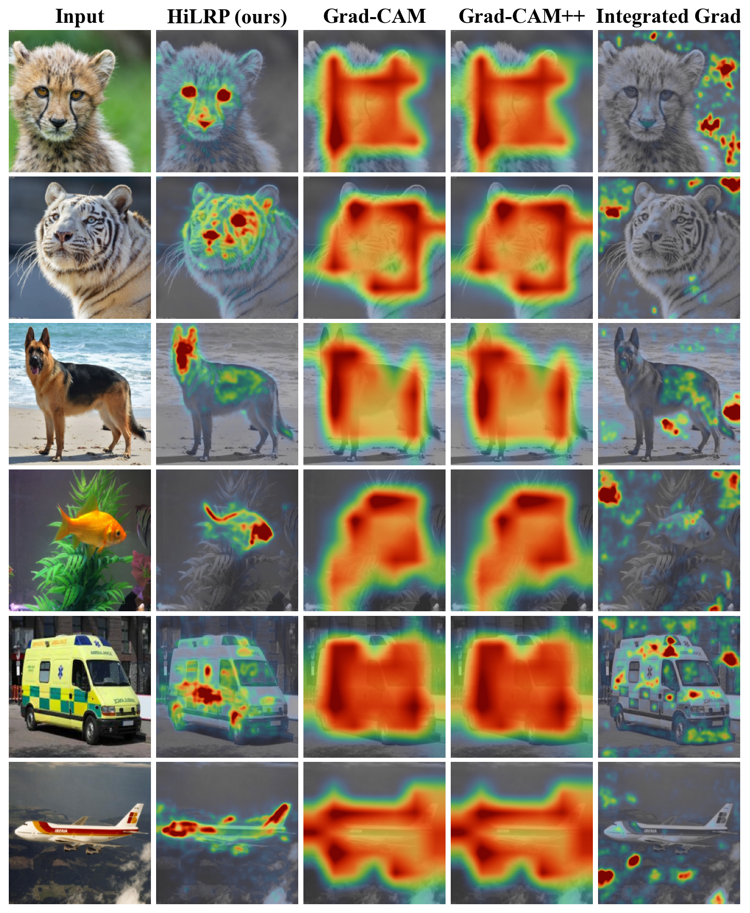

<div align="center">
  <h1>XAI-Bench: Vision Transformer Explainability Benchmark</h1>
  <p><strong>A Controlled Benchmark of Attribution Methods Across Architectures, Pretraining Objectives, and Scales for Vision Foundation Models</strong></p>

  [](https://opensource.org/licenses/MIT)
  [](https://www.python.org/downloads/release/python-390/)
</div>

<br />

## 📖 Overview

While Explainable AI (XAI) has been heavily benchmarked on small Convolutional Neural Networks (CNNs), the same rigor is often missing for Vision Transformer (ViT) foundation models. 

**XAI-Bench** provides a controlled, statistically rigorous framework that measures attribution **fidelity** across three orthogonal axes:
1. 🏗️ **Architecture:** CNN vs. ViT
2. 🎓 **Pretraining Objective:** Supervised vs. Self-supervised (DINOv2) vs. Masked (MAE/BEiT) vs. Contrastive (CLIP/EVA)
3. 📈 **Model Scale:** Small to Giant models

We leverage both **exact/causal ground truth** (synthetic & intervention-based, e.g., FunnyBirds) and **proxy faithfulness metrics** (e.g., Quantus) to evaluate existing explanation methods fairly and transparently.

---

## ✨ Visuals

Here are some sample results from the benchmark:

<p align="center">
  
  <em>Figure 1: Comparison of attribution methods across different architectures.</em>
</p>

<p align="center">
  
  <em>Figure 2: Pareto frontier of attribution methods, trading off fidelity and complexity.</em>
</p>

<p align="center">
  
  <em>Figure 3: Qualitative comparison of different XAI methods.</em>
</p>

---

## 🎯 Key Research Questions Evaluated

- **RQ1 — Transfer:** Do attribution-method fidelity rankings established on CNNs hold on ViT foundation models?
- **RQ2 — Pretraining:** Holding architecture and scale fixed, does the pretraining objective change attribution faithfulness?
- **RQ3 — Scaling:** How does fidelity scale with model size? Is there an "explainability scaling law"?
- **RQ4 — Attention vs. Gradients:** Do attention-native methods beat gradient/perturbation methods on ViTs, and do *register tokens* fix attention-based attribution?
- **RQ5 — Metric Agreement:** How much do faithfulness metrics agree with each other and with controllable ground truth?

---

## 🔬 Benchmark Scope

### Supported Models
- **Self-Supervised & Contrastive:** DINOv2 (with/without register tokens), CLIP-ViT, EVA02-CLIP
- **Masked Autoencoders:** MAE, BEiT3
- **Supervised Baselines:** Supervised ViTs, ResNet, ConvNeXt

### Evaluated XAI Methods
- **Gradient-based:** Saliency, Integrated Gradients, SmoothGrad
- **CAM-based:** Grad-CAM, Grad-CAM++
- **Attention-native:** Rollout, Attention Flow, Chefer/LRP, Hi-LRP
- **Perturbation-based:** Occlusion, RISE, LIME, KernelSHAP

### Datasets & Metrics
- **Datasets:** ImageNet-S, ImageNet-1k, FunnyBirds, MS COCO
- **Metrics:** Faithfulness, Localization, Robustness, and Complexity (powered by [Quantus](https://github.com/understandable-machine-intelligence-lab/Quantus)).

---

## 🚀 Installation & Setup

1. **Clone the repository:**
   ```bash
   git clone https://github.com/yourusername/XAI-Bench.git
   cd XAI-Bench
   ```

2. **Install the base package:**
   ```bash
   pip install -e .
   ```

3. *(Optional)* **Install extra dependencies** (for clustering, advanced CAMs, and Quantus metrics):
   ```bash
   pip install -e ".[extra]"
   ```

---

## 💻 Quickstart

### Running a Benchmark

The easiest way to run a benchmark is to use the `xai-bench` command-line tool with a configuration file.

1. **Choose a configuration file** from the `configs/` directory. For example, `configs/smoke_test_quantus.yaml`.

2. **Run the benchmark:**
   ```bash
   xai-bench --config configs/smoke_test_quantus.yaml
   ```

This will run the benchmark with the specified models, methods, and metrics, and save the results in the `results/` directory.

### Running a single explanation

To run a single explanation on an image, you can use the `run_imagenets_xai.py` script, which has been moved to the `scripts/` directory.

```bash
python scripts/run_imagenets_xai.py
```

---

## 📂 Repository Structure

The repository is structured as follows:

```
├── configs/            # Configs for benchmarking sweeps
├── data/               # Data loading scripts and dataset structures
├── figures/            # Figures for the paper and README
├── images/             # Sample images for testing
├── scripts/            # Helper scripts for running experiments, plotting, etc.
├── tests/              # Unit tests
└── xai_bench/          # Core Python framework for XAI methods & models
```

---

## 📝 License & Citation

This project is open-source under the MIT License. If you use XAI-Bench in your research, please cite our paper:
*(Citation details coming soon)*